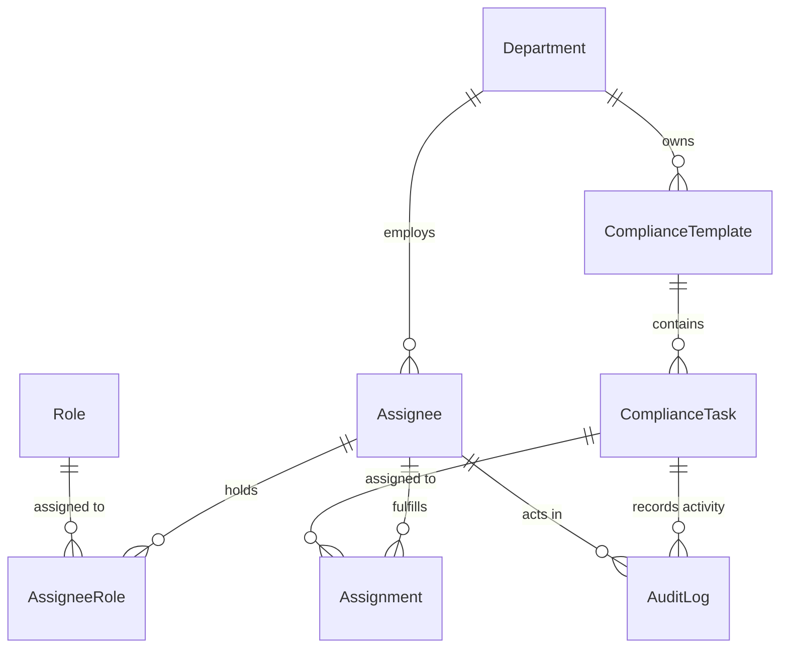

# Compliance Data Model

This document outlines the relational data model that underpins the compliance workflow service. The diagram and tables below are intended to help future maintainers reason about how information is connected and which entities own specific responsibilities.

## Entity Overview

### Department
* Represents a functional area accountable for compliance tasks.
* Has many assignees and may optionally own compliance templates.

### Assignee
* Individual responsible for executing compliance work.
* Belongs to exactly one department.
* Receives zero or more role assignments via the `assignee_roles` join table.
* Can be associated with task assignments and audit log entries.

### Role
* Canonical set of permissions or responsibilities (e.g., _Compliance Manager_).
* Linked to assignees through `assignee_roles`.

### ComplianceTemplate
* Describes a reusable set of compliance tasks (e.g., ISO, SOX programs).
* Versioned by the `(name, version)` composite key so revisions can be tracked.
* Optionally scoped to a department.

### ComplianceTask
* Atomic unit of work derived from a template.
* Enforces uniqueness of `title` per template to avoid duplicate task definitions.
* Can have many assignments and audit log entries.

### Assignment (join table)
* Connects assignees to the tasks they must complete.
* Includes workflow metadata such as status, due date, and completion timestamp.

### AuditLog
* Immutable record of task-related activity.
* Optionally references both the actor (assignee) and the affected task.
* Stores arbitrary JSON metadata for extensibility.

## Indexes & Constraints

* Every primary entity uses UUID identifiers with automatically managed `created_at` and `updated_at` timestamps.
* Foreign keys enforce referential integrity with cascading deletes where appropriate (e.g., assignments removed when either the task or assignee is deleted).
* Dedicated indexes on foreign key columns (`department_id`, `template_id`, `task_id`, etc.) keep relational lookups efficient.
* Trigger functions maintain `updated_at` timestamps automatically for mutable tables.
